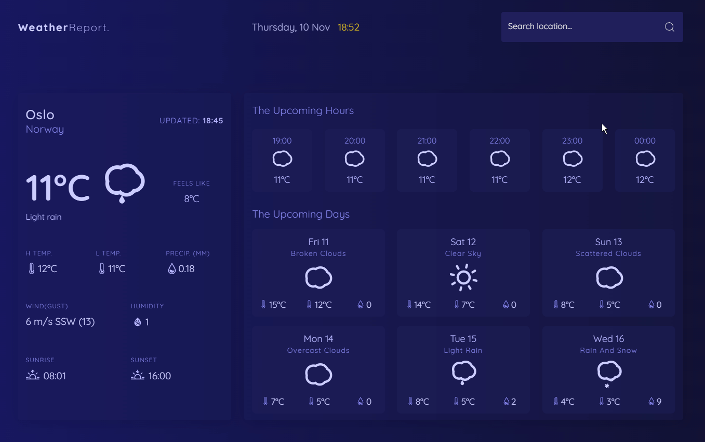

#WeatherReport. ☀️

> A weather app developed using React and the [openweathermap](https://openweathermap.org/) API.

## Built with

- React
- SCSS

## To Add

- Add option to get weather on current location with geolocation.
- Refactor SCSS
- Toggle between °C and °F

## 🤝 Contributing

Contributions, issues, and feature requests are welcome!
